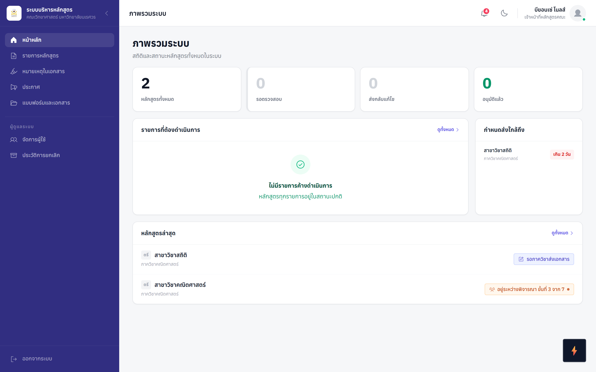
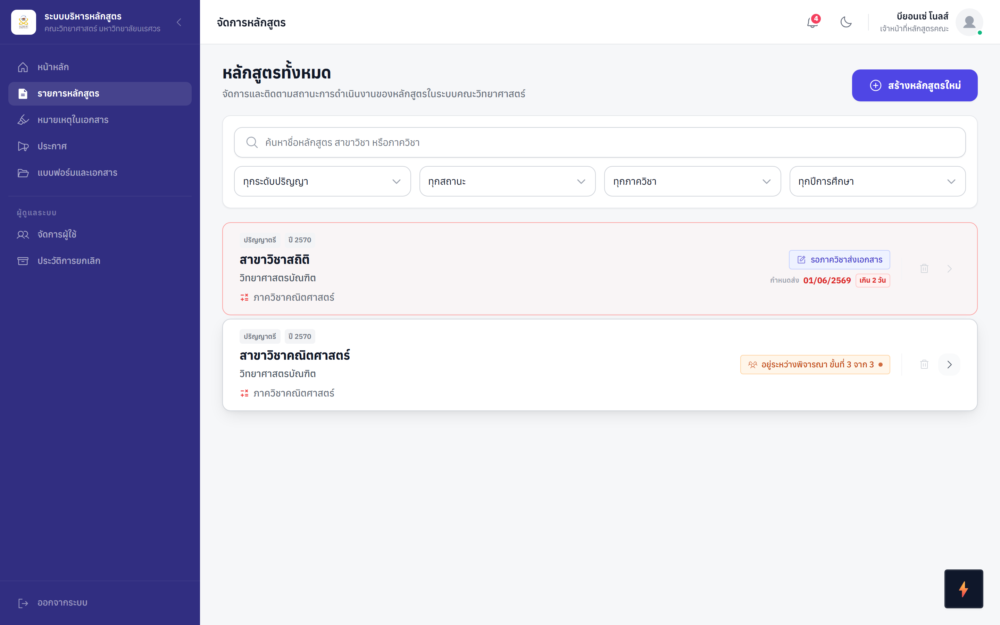
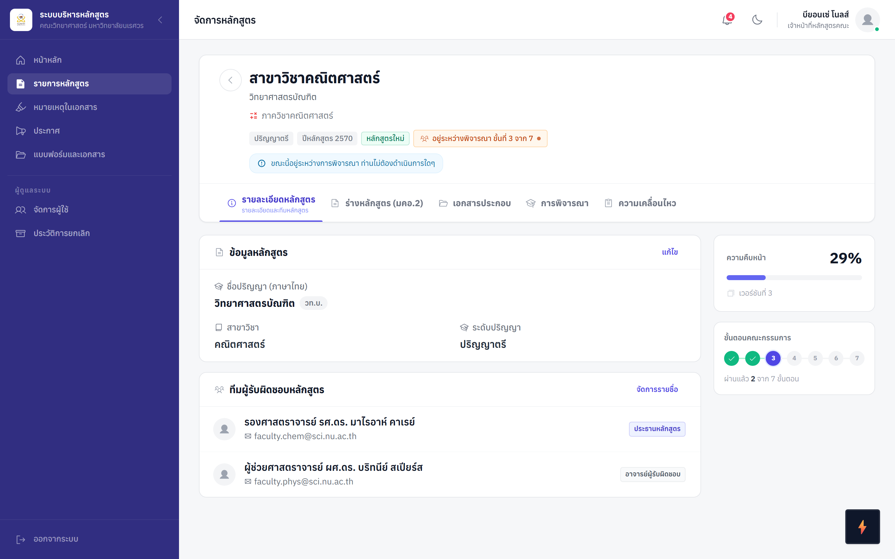
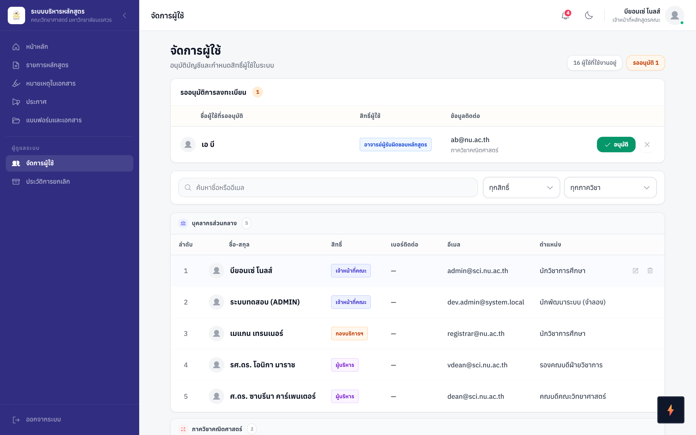
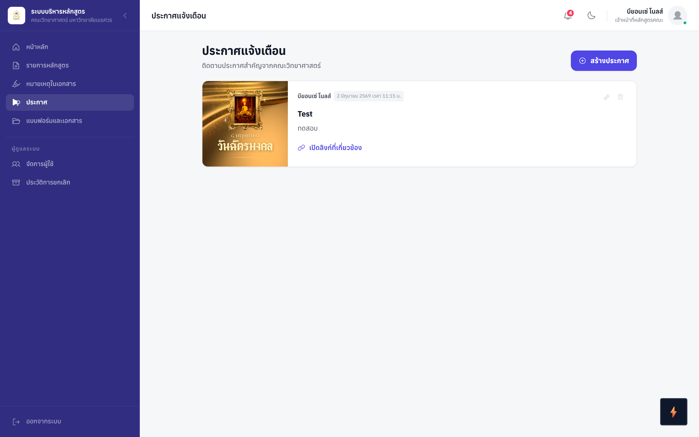
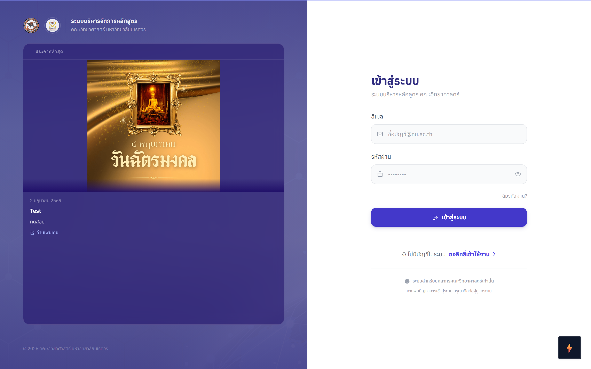

<div align="center">

# 🎓 ระบบบริหารจัดการหลักสูตร
### Curriculum Management System — คณะวิทยาศาสตร์ มหาวิทยาลัยนเรศวร

แพลตฟอร์มศูนย์กลางสำหรับ **สร้าง ติดตาม และอนุมัติหลักสูตรการศึกษา** ตั้งแต่ภาควิชายื่นเอกสาร
ไปจนผ่านคณะกรรมการครบทุกระดับจนถึง "อว. อนุมัติ" — แทนที่การไล่ตามเอกสารแบบแมนนวล
ด้วยกระบวนการออนไลน์ที่เห็นสถานะทุกขั้นตอนแบบเรียลไทม์

<br/>



</div>

---

## ✨ ระบบนี้ทำอะไร?

หลักสูตรหนึ่งกว่าจะได้รับอนุมัติต้องผ่าน **คณะกรรมการ 8 ชุด 3 ระดับ** (คณะ → มหาวิทยาลัย → สภาฯ)
แต่ละขั้นมีการอัปโหลดมติ ตีกลับแก้ไข และเก็บเอกสารหลายเวอร์ชัน ระบบนี้รวมทุกอย่างไว้ในที่เดียว:

| 🧩 ความสามารถ | รายละเอียด |
|---|---|
| 📊 **ติดตามสถานะอัตโนมัติ** | รู้ทันทีว่าหลักสูตรอยู่ขั้นไหน "ระดับคณะ X/Y" พร้อมแถบความคืบหน้า |
| 👥 **แยกสิทธิ์ 4 บทบาท** | นักวิชาการศึกษา · อาจารย์/สาขา · กองบริการการศึกษา · ผู้บริหาร |
| 📁 **คลังเอกสารแบบ Google Drive** | อัปโหลด PDF/DOCX ได้อิสระ เก็บทุกเวอร์ชันพร้อม Timestamp |
| 🔁 **เวิร์กโฟลว์อนุมัติ + ตีกลับ** | ตีกลับให้สาขาแก้ → ส่งกลับมาเริ่มที่ขั้นเดิม ไม่ต้องเริ่มใหม่ |
| 📝 **เปรียบเทียบ มคอ.2 (TQF2)** | Text Diff อัตโนมัติทีละหมวด (หมวด 1–8) ระหว่างเวอร์ชัน |
| 🔔 **แจ้งเตือน Email + In-app** | ทุก Transaction สำคัญ พร้อมระบบประกาศและ Audit Log |

---

## 📸 หน้าจอระบบ

### รายการหลักสูตร — ค้นหา กรอง และดูสถานะทุกหลักสูตรในที่เดียว


### รายละเอียดหลักสูตร — ทีมผู้รับผิดชอบ เอกสาร และความคืบหน้าคณะกรรมการรายขั้น


### จัดการผู้ใช้ — อนุมัติผู้สมัครใหม่ และกำหนดสิทธิ์ตามบทบาท


### ประกาศแจ้งเตือน & หน้าเข้าสู่ระบบ
<table>
<tr>
<td width="50%"></td>
<td width="50%"></td>
</tr>
</table>

---

## 👤 บทบาทผู้ใช้งาน

| บทบาท | ผู้ใช้ | สิทธิ์โดยสรุป |
|---|---|---|
| `admin` | นักวิชาการศึกษา | สร้างหลักสูตร ตรวจ/ตีกลับเอกสาร อัปโหลดมติ จัดการประกาศและผู้ใช้ |
| `faculty` | อาจารย์/เจ้าหน้าที่สาขา | อัปโหลด/แก้ไขเอกสาร ดูข้อมูลเฉพาะภาควิชาตน |
| `registrar` | กองบริการการศึกษา | ดู/ดาวน์โหลดเฉพาะเอกสารขั้นวิชาศึกษาทั่วไป |
| `executive` | ผู้บริหารคณะ | ดู Dashboard ภาพรวม (View-only) |

---

## 🔄 ขั้นตอนการอนุมัติ (Approval Flow)

```
ภาควิชายื่นเอกสาร  →  นักวิชาการศึกษาตรวจสอบ  →  คณะกรรมการ 8 ชุด ตามลำดับ  →  อว. อนุมัติ
                                  ↑__________ ตีกลับแก้ไข (กลับมาเริ่มที่ขั้นเดิม) __________↓
```

| สถานะ | ความหมาย |
|---|---|
| `pending_department` | รอภาควิชาดำเนินการ |
| `department_submitted` | ภาควิชาส่งหลักสูตรแล้ว |
| `under_committee` | อยู่ระหว่างพิจารณา — แสดง "ระดับคณะ X/Y" |
| `revision` | หลักสูตรอยู่ระหว่างแก้ไขจากที่ถูกตีกลับ |
| `approved` | หลักสูตร อว. อนุมัติ |

คณะกรรมการ 8 ชุด: วิชาการประจำคณะ → คณะกรรมการประจำคณะ → ตรวจวิชาศึกษาทั่วไป →
วิชาการ มน. → บัณฑิตวิทยาลัย → สภาวิชาการ มน. → สภามหาวิทยาลัย → CISA
*(แต่ละชุดมีผลกับระดับปริญญาตรี/โท/เอก ต่างกันตามข้อบังคับ)*

---

## 🛠️ เทคโนโลยีที่ใช้

| ส่วน | เทคโนโลยี |
|---|---|
| **Frontend** | Vue 3 (Composition API) · Vite · Pinia · Vue Router · Tailwind CSS · Heroicons |
| **Backend** | Node.js · Express · Sequelize (ORM) |
| **Database** | MySQL |
| **Auth & Security** | JWT · bcryptjs · Helmet · express-rate-limit |
| **เอกสาร & อีเมล** | Multer · mammoth/pdf-parse (อ่าน DOCX/PDF) · Nodemailer |

---

<div align="center">
<sub>พัฒนาเพื่องานบริการหลักสูตร คณะวิทยาศาสตร์ มหาวิทยาลัยนเรศวร</sub>
</div>
