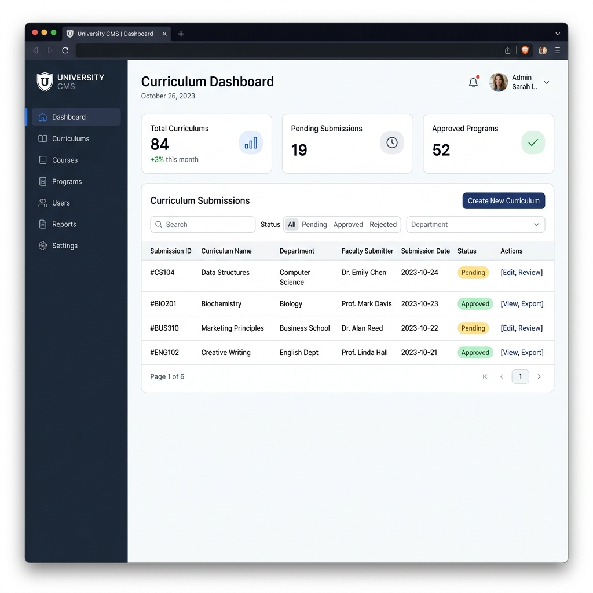

# Curriculum Management System

A centralized platform for managing, tracking, and auditing academic curricula for the Faculty of Science, Naresuan University. This system replaces manual document tracking with an automated pipeline, providing clear visibility into the curriculum approval process.

## Dashboard Overview



## Key Features

- **Automated Pipeline:** Track the exact status of a curriculum in the approval process.
- **Role-Based Access Control:** Specifically tailored workflows for Faculty Members, Administrators, Executives, and Registrars.
- **Document Management:** Securely upload, review, and audit TQF documents.
- **Modern Interface:** A clean, professional, and mobile-accessible design reflecting a modern educational brand.

## Technology Stack

- **Frontend:** Vue.js 3, Vite, Tailwind CSS, Pinia, Vue Router
- **Backend:** Node.js, Express, Sequelize (ORM), MySQL
- **Security & Authentication:** JWT, bcryptjs, Helmet

## Getting Started

### Prerequisites

- Node.js
- MySQL Database

### Installation & Setup

1. Clone the repository:
   ```bash
   git clone https://github.com/kitsanahp/Curriculum-Management-System.git
   ```

2. Setup Backend:
   ```bash
   cd backend
   npm install
   # Create a .env file based on environment requirements
   npm run dev
   ```

3. Setup Frontend:
   ```bash
   cd frontend
   npm install
   npm run dev
   ```
